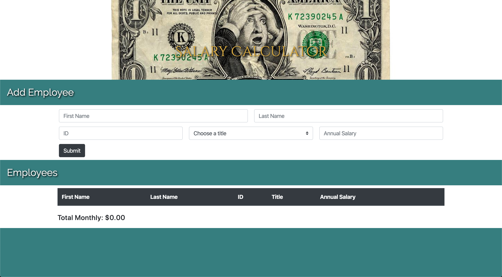

# Salary Calculator

## Description

_Duration: 1 Weekend_

This site it's designed for companies or corporations with many employees. It grabs the data submitted by the user and creates a table with general information for employees and their annual salary. Then it displays the total monthly cost to pay those employees which will update every time you add new data. There is a remove button to delete any employee no longer working in the company which will also update the total monthly cost. Lastly, it has an adjustable budget of $20,000.00 per month so if the total monthly cost goes over the budget it will turn the cost red.

To see the fully functional site, please visit: [DEPLOYED VERSION OF APP](www.heroku.com)

## Screen Shot

## Built With

Javascript
jQuery
Bootstrap

## License
[MIT](https://choosealicense.com/licenses/mit/)

## Acknowledgement
Thanks to [Prime Digital Academy](www.primeacademy.io) who equipped and helped me to make this application a reality.

## Support
If you have suggestions or issues, please email me at [blyblz5@gmail.com](mailto: blyblz5@gmail.com)
